# 🍽️ Gr8Food Restaurant Management System

A desktop-based restaurant management system built with **C# Windows Forms** and **Microsoft SQL Server**. The system provides role-based functionality for customers, chefs, managers, and administrators, covering the complete restaurant ordering and management workflow.

## 📌 Project Overview

Gr8Food is designed to manage restaurant operations from customer food browsing and ordering to kitchen order processing, wallet transactions, feedback management, menu management, and administrative reporting.

The project demonstrates the use of **C#**, **Windows Forms**, **SQL Server**, database connectivity, CRUD operations, role-based access, and desktop UI design.

## 🛠️ Tech Stack

- **Language:** C#
- **Framework:** Windows Forms
- **Database:** Microsoft SQL Server
- **IDE:** Visual Studio
- **Database Connectivity:** ADO.NET / SqlClient

## ✨ Key Features

### 👤 Customer
- User profile management
- Browse food items
- Search food by name
- Add items to cart
- Place orders
- View order status
- Wallet balance and top-up
- Submit feedback

### 👨‍🍳 Chef
- View customer orders
- Manage kitchen orders
- Update order status

### 👨‍💼 Manager
- Manage menu items
- Manage orders
- Manage customer feedback
- View sales information
- Access management reports

### 🛡️ System Administrator
- Manage system users
- Manage user roles
- Manage restaurant menu
- Access sales reports
- Monitor wallet transactions
- Manage feedback

## 📊 Management & Reporting

The system includes several management features:

- Sales reporting
- Wallet transaction reporting
- User management
- Menu management
- Feedback management
- Order management
- Order status tracking

## 🖥️ Screenshots

### Login Page
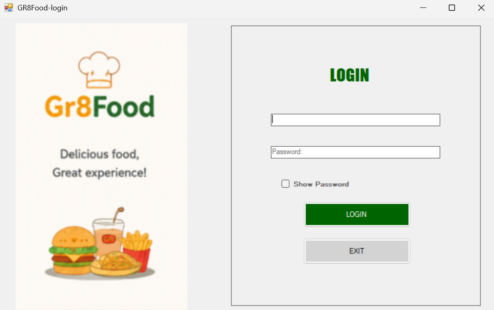

### Customer Dashboard
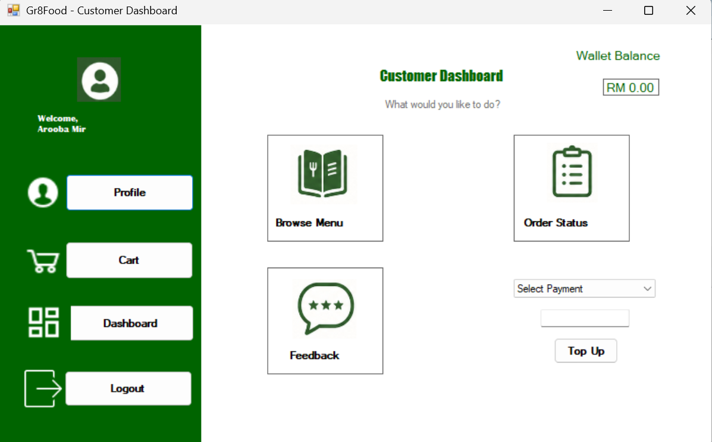

### Menu
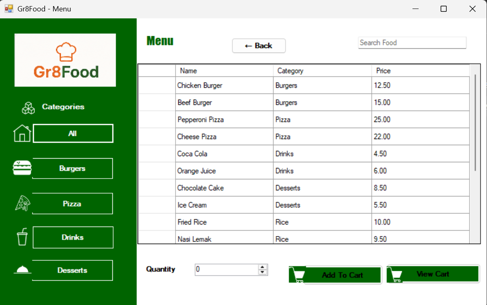

### Cart
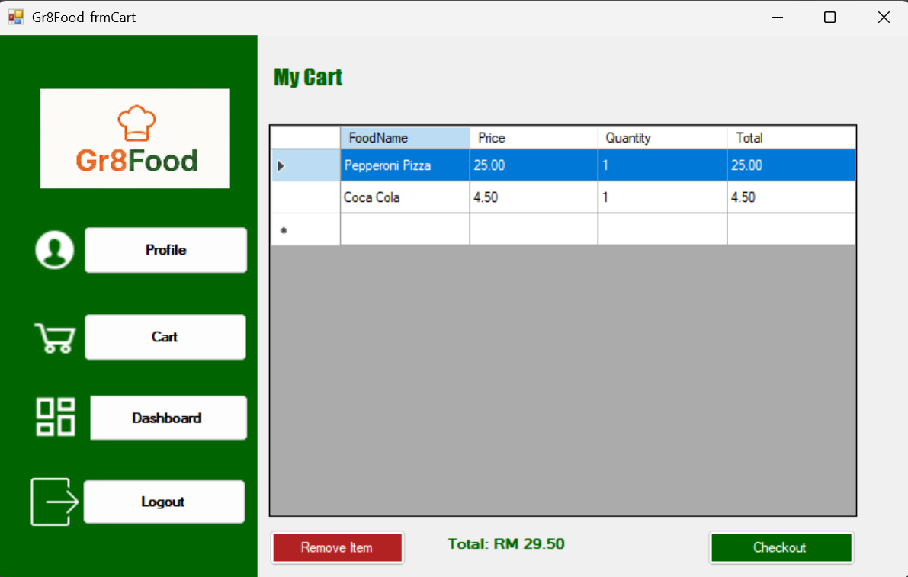

### View Orders
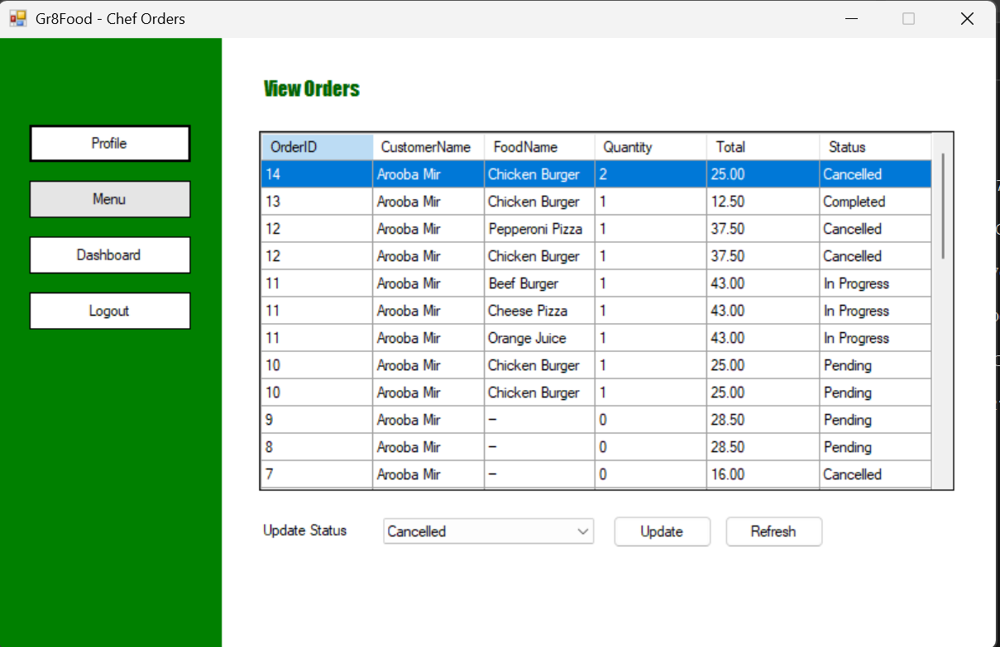

### Order Status
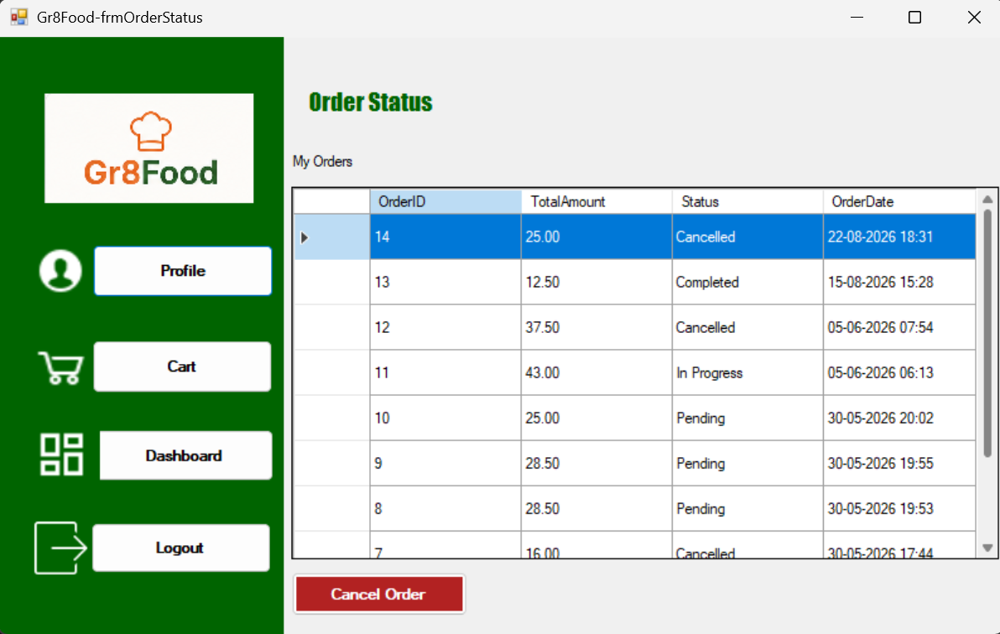

### Wallet Report
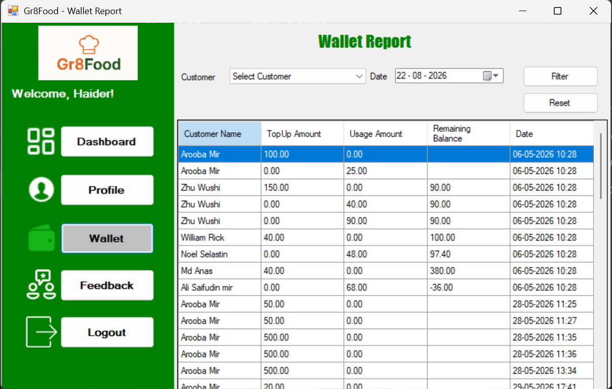

### Customer Feedback
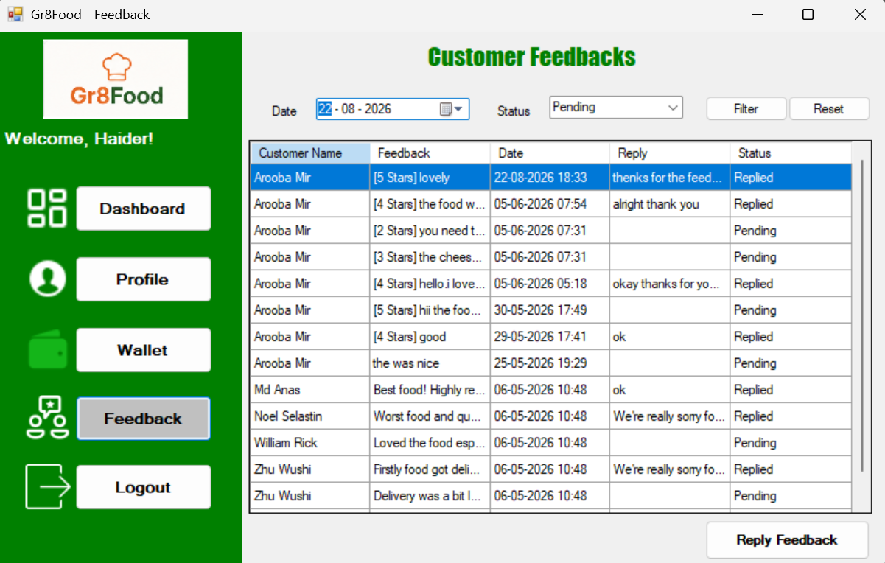

### Profile Page
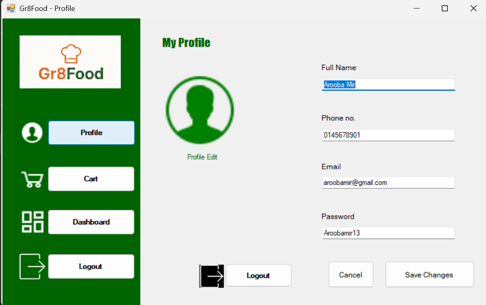

### Chef Dashboard
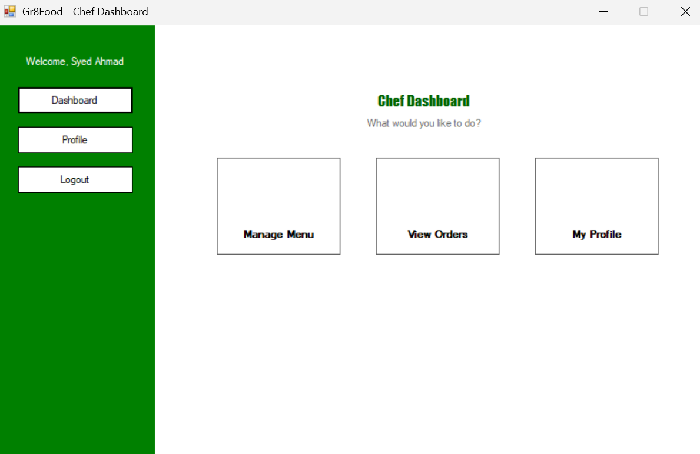

### Manager Dashboard


### Admin Dashboard
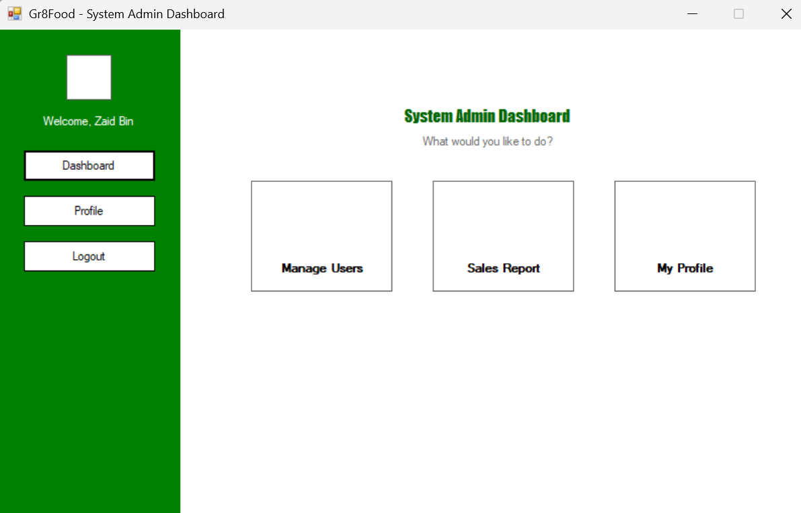

### Manage Menu
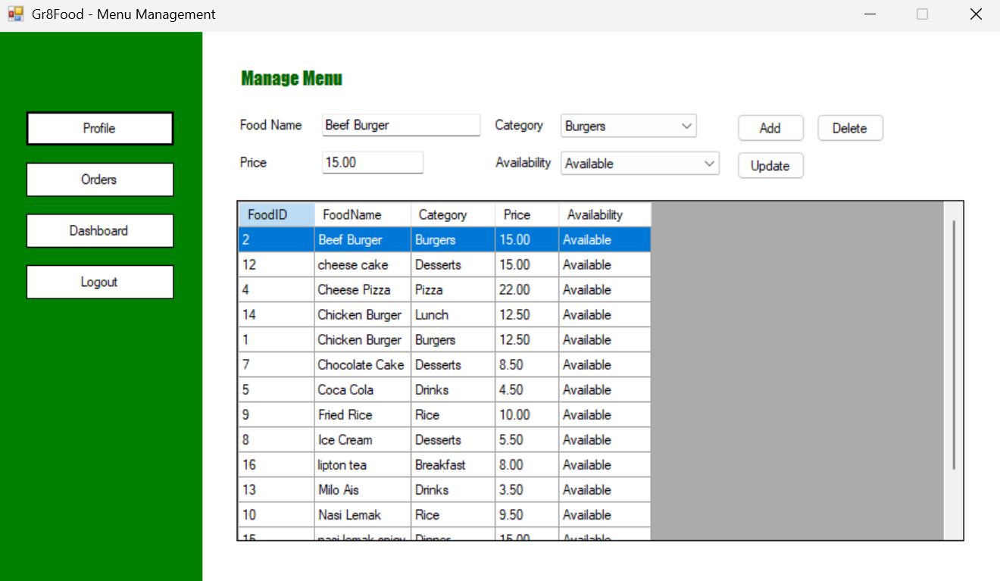

### Manage Users
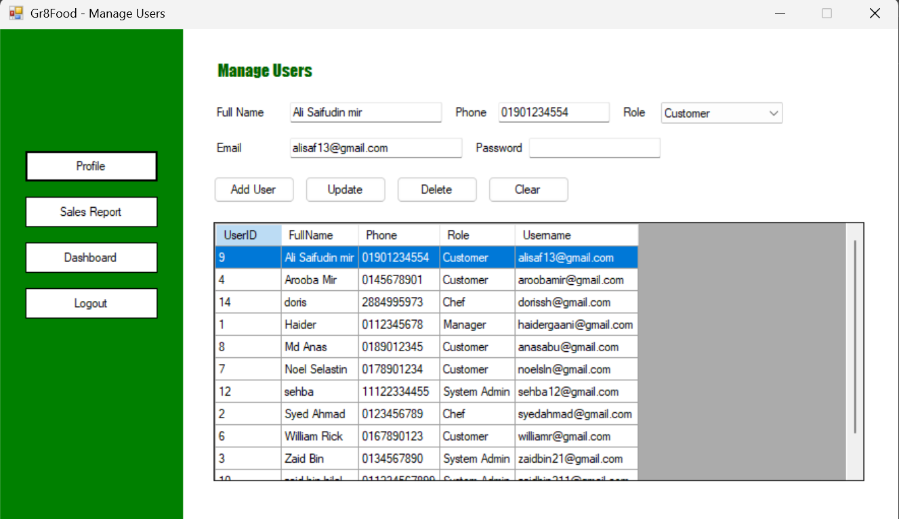

### Sales Report
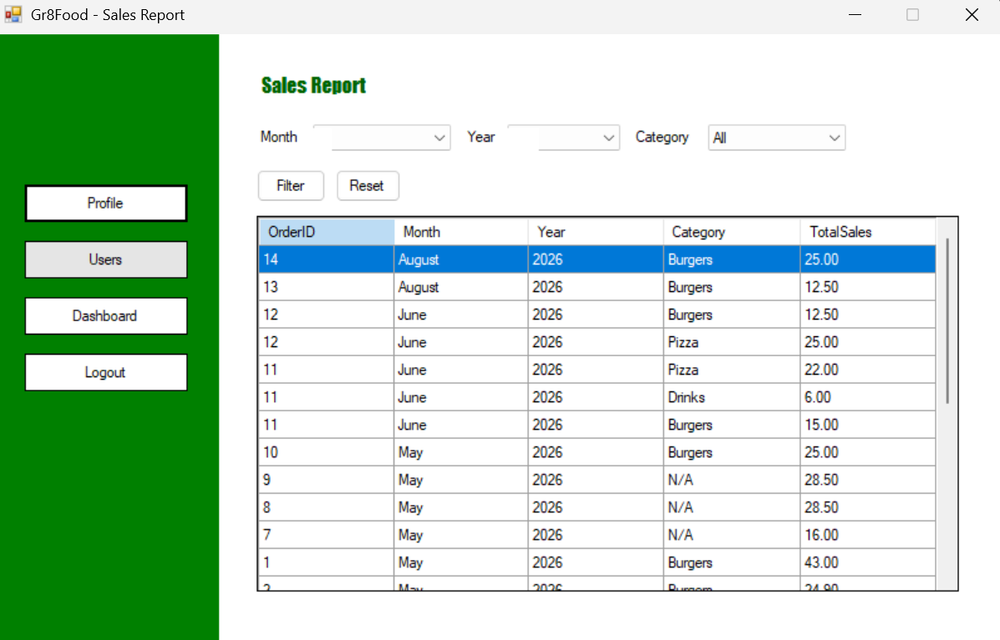

### Feedback Management — Manager View
.png)

## 🗂️ Project Structure

```text
Gr8Food-Restaurant-Management-System/
│
├── Gr8Food_Submission/
├── Manager/
├── Properties/
├── Resources/
├── screenshots/
├── .gitignore
├── Gr8Food.sln
└── Gr8Food management system.csproj
